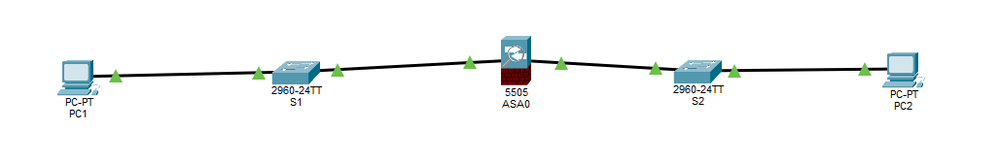
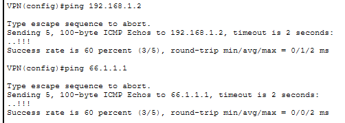

# ASA Firewall & SSH Lab

## Objective
Configure a Cisco ASA 5505 firewall with inside and outside interfaces, enable SSH access, configure VLAN connectivity, and verify communication between the ASA and switches in Packet Tracer.

## Topology
1 Cisco ASA 5505 
2 Cisco 2960 switches 
1–2 PCs 
Inside and outside VLAN connections 
Ethernet connections between ASA and switches 

## Learned
Configured ASA inside and outside VLAN interfaces
 
Assigned security levels and IP addresses
 
Configured switch VLANs and management interfaces
 
Connected switches to ASA interfaces
 
Enabled SSH access on the ASA 
Generated RSA keys for secure remote access 
Configured local username authentication 
Verified connectivity using ping commands 
Learned how ASA VLAN interfaces differ from normal router interfaces 
Saved configurations using write memory 
Tested communication between inside and outside networks 

