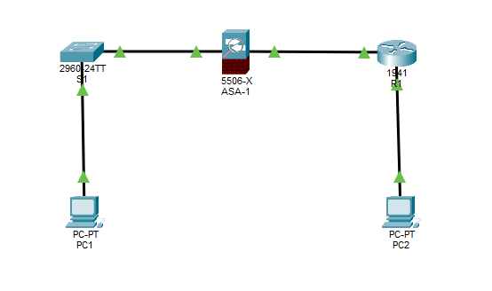

# Perform Basic Setup of ASA and AA on Cisco Router

## Topology
- 1 Cisco ASA 5505
- 1 Layer 2 Switch (3560)
- 1 PC with console port
- 2 PC or Laptops
- 1 Cisco Router (2901) 
Inside and outside VLAN connections 
Ethernet connections between ASA and switches

## Objective
- Perform a basic setup of an ASA
- Configure AAA on Cisco router
- Validate ASA is blocking traffic
