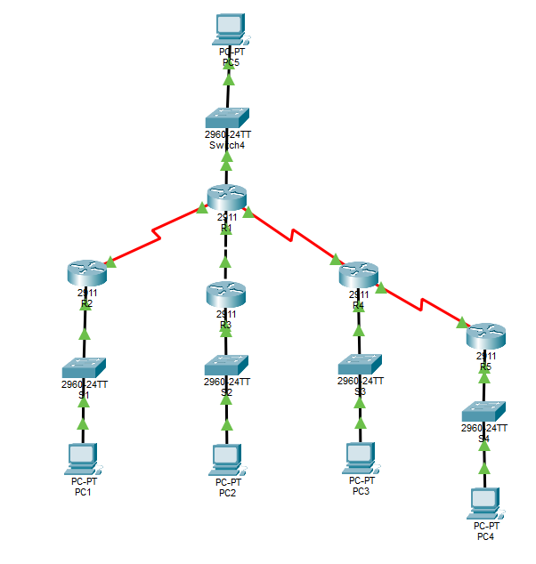

CIDR / VLSM Network Design Lab

Objectives
- Designing a subnetting plan using CIDR and Variable Length Subnet Masking (VLSM). 
- Built in Cisco Packet Tracer using multiple routers, LAN segments, and point-to-point WAN links.

Practiced
- CIDR addressing
- VLSM subnetting
- Router interface configuration
- Static routing or dynamic routing
- Packet Tracer topology design
- Connectivity testing with ping

