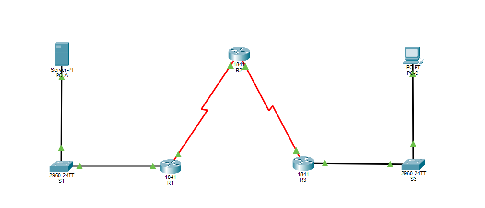

# Configuring Context-Based Access Control (CBAC)

## Objective
- Verify connectivity among devices before firewall configuration
- Configure an IOS firewall with CBAC on router R3
- Verify CBAC functionality using ping, Telnet, and HTTP

## Topology
- 3 Routers (1841)
- 2 Switches (2960)
- 1 Server 
- 1 PC

## Practiced
- Built a multi-router CBAC firewall topology in Cisco Packet Tracer
- Configured routing between internal and external networks
- Configured extended ACLs to block inbound outside traffic
- Implemented Cisco IOS CBAC firewall inspection rules
- Configured inspection for ICMP, Telnet, and HTTP traffic
- Applied CBAC inspection rules to router interfaces
- Configured timestamped logging and CBAC audit trail messages
- Verified firewall operation using ping, Telnet, and web traffic tests
- Used show ip inspect commands to monitor active sessions
- Used CBAC debug commands for firewall troubleshooting