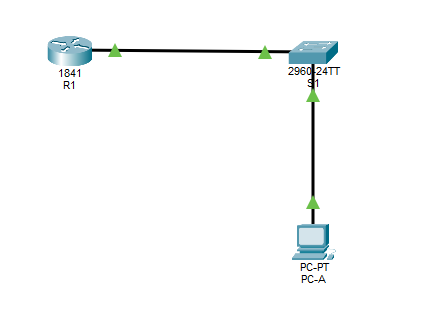

# Configure Router Security

## Objective
- Configure Encrypted Passwords & SSH on Routers R1
- Configure Administrative Role
- Configure syslog Support on R1 and PC-A

## Topology
- 1 Router (1841)
- 1 Switch (2960)
- 1 PC

## Learned
- Reset router and switch configs to factory defaults
- Configured secure console, VTY, and enable passwords
- Enabled password encryption and minimum password length
- Created local users and configured SSH remote access
- Generated RSA keys and tested SSH login with PuTTY
- Configured AAA and parser views for admin role access
- Secured Cisco IOS image and configuration files
- Configured R1 as an NTP master and synchronized switch time
- Enabled syslog logging to a PC-based syslog server
- Verified SSH, NTP, and syslog functionality with show commands