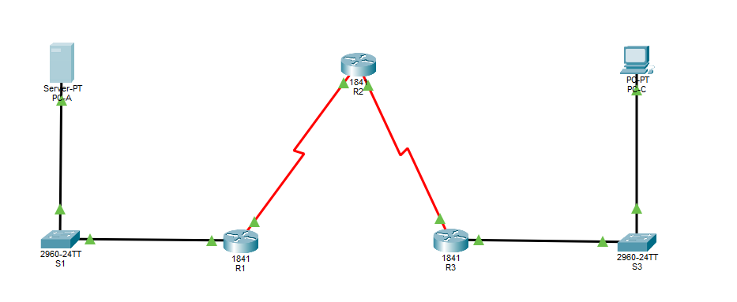

# Configuring a Zone-Based Policy Firewall (ZPF)

## Objective
- Verify connectivity among device before firewall configuration
- Configure a zone-based policy (ZPF) firewall on router R3
- Verify ZPF firewall functionality using ping, Telnet, and a web browser

## Topology
- 3 Routers (1841)
- 2 Switches (2960)
- 1 Server 
- 1 PC

## Learned
- Built a Zone-Based Policy Firewall lab in Cisco Packet Tracer
- Configured a 3-router network with inside and outside LANs
- Verified baseline ping, Telnet, and web access before firewall rules
- Created inside and outside security zones on R3
- Built an ACL to identify internal network traffic
- Created class maps and policy maps for inspected traffic
- Applied zone pairs to control IN-ZONE to OUT-ZONE traffic
- Assigned router interfaces to the correct security zones
- Verified inside users could reach outside resources
- Confirmed outside traffic was blocked from reaching inside hosts