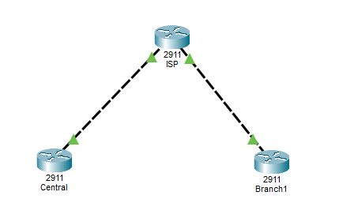

## Topology
3 Routers (2911)

## Objectives
- Built a site-to-site IPSec VPN topology in Cisco Packet Tracer
- Configured Central, ISP, and Branch routers with WAN addressing
- Created loopback networks to simulate remote LAN traffic
- Configured IKE Phase 1 policies and pre-shared authentication keys
- Configured IPSec transform sets and crypto maps
- Defined interesting traffic using extended ACLs
- Applied VPN policies to router WAN interfaces
- Configured static routes for encrypted tunnel communication
- Verified tunnel establishment using ISAKMP and IPSec show commands
- Tested encrypted connectivity between remote networks