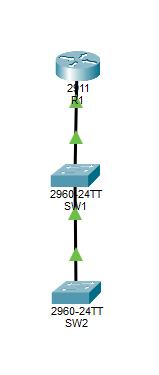

# Implement Layer 2 Security Best Practices

## Topology
- 2 Switches (3850)
- 1 Cisco IOS Router (2911)

## Objective
- Connect devices to perform basic setup
- Configure DHCP on R1
- Implement DHCP snooping on SW1 and SW2
- Configure dynamic ARP inspection on SW1 and SW2
- Configure Port Security
