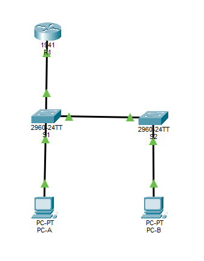

# Securing Layer 2 Switch

## Topology
1 Cisco Router (2900)
2 Cisco 2960 Switches
2 PCs

## Objective
Part 1: Configure Basic Switch Settings
Build the topology
Configure the hostname, IP address, and access passwords

Part 2: Configure SSH Access to Switches
Configure SSH version 2 access on the switch
Configure an SSH client to access the switch
Verify the configuration

Part 3: Configure Secure Trunks and Access Ports
Configure trunk port mode
Change the native VLAN for trunk ports
Verify trunk configuration
Enable storm control for broadcasts
Configure access ports
Enable PortFast and BPDU guard
Verify BPDU guard 
Enable root guard
Enable loop guard 
Configure and verify port security 
Disable unused ports
Move ports from default VLAN 1 to alternate VLAN
Configure the PVLAN Edge feature on a port

Part 4: Configure IP DHCP Snooping
Configure DHCP on R1
Configure Inter-VLAN communication on R1
Configure S1 interface F0/5 as a trunk
Verify DHCP

