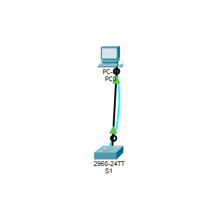

# Switching Lab

## Objective
Verify the default configuration of a Cisco Catalyst switch and configure basic VLAN interface settings.

## Topology
- 1 PC
- 1 Switch
- Console connection (PC → Switch)
- Ethernet connection (PC → FastEthernet0/1)

## Learned
- Connected the PC to the switch console port
- Connected the PC to FastEthernet0/1
- Accessed the switch through the terminal
- Entered privileged EXEC mode
- Checked the default switch configuration
- Viewed VLAN and interface information
- Configured VLAN 1 with an IP address
- Enabled the interface using `no shutdown`
- FastEthernet0/1 does not have an IP address because it is a Layer 2 switch port. On a switch, IP addresses are assigned to VLAN interfaces, such as VLAN 1, for management purposes.

## Key Commands
enable 
show running-config 
show startup-config 
show vlan brief 
show ip interface brief 
interface vlan 1 
ip address 192.168.1.2 255.255.255.0 
no shutdown 
